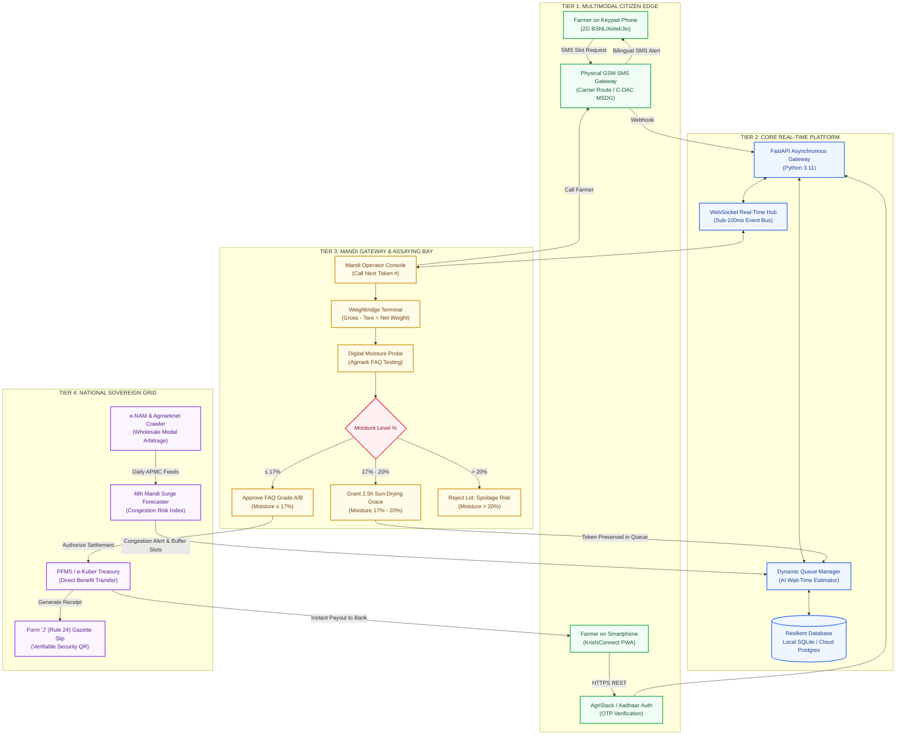

# KRISHICONNECT · SYSTEM ARCHITECTURE & FLOWCHART SPECIFICATION
## Team Name: Nexora | Smart India Hackathon (SIH) 2026 | PS ID: 26032 (DoCA)

---

> ### How to Use This Document:
> 1. **To generate an AI image/photo of the flowchart**: Copy and paste the prompt in **Section 1** into **Midjourney**, **Ideogram 2.0**, **DALL-E 3**, or **Google Imagen 3**.
> 2. **To render an interactive vector diagram**: Copy the **Mermaid.js code** in **Section 3** and paste it into [mermaid.live](https://mermaid.live) or **Draw.io** to export a high-resolution PNG/SVG for Slide 3 of your PPT.

---

# SECTION 1: MASTER AI IMAGE GENERATION PROMPT (PHOTO / INFOGRAPHIC)

### Prompt for Midjourney v6 / Ideogram / DALL-E 3 / Imagen 3:
```text
An ultra-high-definition, professional enterprise architecture flowchart infographic for a Government of India digital agricultural platform named "KrishiConnect". 

Style: Crisp isometric 3D vector diagram, clean modern GovTech aesthetics, Digital India and e-NAM color palette (deep forest green #14532d, government navy blue #0f172a, saffron amber accents, crisp white background). 

Layout: Structured 4-tier horizontal flow with clearly demarcated layers and directional glowing data pipes connecting them:

Tier 1 (Left - Citizen Inclusivity Layer): 
- Vintage Nokia/Samsung keypad feature phones receiving bilingual GSM SMS alerts ("Token #A102 10:30 AM").
- Farmer smartphone displaying a clean Progressive Web App (PWA) with QR token.
- Label: "Tier 1: Multimodal Farmer Access (Zero-App Keypad GSM + PWA)".

Tier 2 (Center-Left - Mandi Physical Intake & Quality Edge):
- Tractor on a heavy-duty weighbridge bay with digital LED weight indicator (2,450 kg).
- Mandi Gate Assayer holding a calibrated digital moisture probe meter with a digital gauge showing "14.2% - FAQ Grade A".
- Yard with sun-drying grain plots labeled "2.5h Yard Sun-Drying Grace Area".
- Label: "Tier 2: Mandi Gate Assayer & Agmark Moisture Assaying Edge".

Tier 3 (Center-Right - Real-Time Core Processing Hub):
- Central server cluster with illuminated badges for "FastAPI Async Engine", "WebSockets Real-time Sync (50ms)", and "Local-First Resilient Database (SQLite / PostgreSQL)".
- Real-time queue controller with moving counter displays (Counter #1, Counter #2).
- AI moving average wait-time predictor module labeled "AI EMA Surge Engine".
- Label: "Tier 3: Asynchronous High-Throughput Queue & Transaction Core".

Tier 4 (Right - National Sovereign Infrastructure & Banking):
- National Agriculture Market building labeled "e-NAM (enam.gov.in) APMC Price Arbitrage Crawler".
- Reserve Bank of India / PFMS banking vault transmitting instant Direct Benefit Transfer (DBT) funds.
- Official printable Government Gazette Form 'J' invoice with official seal and verifiable QR code.
- Label: "Tier 4: National Mandi Grid, C-DAC Gateway & PFMS DBT Settlement".

Text: Crisp, legible typography with clean technical callouts, high contrast, clean vector arrows, enterprise tech blueprint, 8k resolution, award-winning infographic design. --ar 16:9 --v 6.0
```

---

# SECTION 2: END-TO-END ARCHITECTURAL DECOMPOSITION

KrishiConnect is engineered as an **offline-resilient, event-driven GovTech procurement pipeline** spanning 4 decoupled architectural layers:

```
┌────────────────────────────────────────────────────────────────────────────────────────┐
│                        TIER 1: MULTIMODAL CITIZEN ACCESS LAYER                         │
│  [2G/3G Keypad Feature Phones]                 [Smartphones & Desktop PWA]            │
│  • GSM Carrier Physical SMS (Twilio / MSDG)   • React 18 + Tailwind PWA (Zero Install) │
│  • Bilingual SMS (Bengali, Hindi, English)    • AgriStack Farmer ID & Aadhaar Login   │
│  • Master Master OTP & Token Retrieval        • Real-time WebSocket Queue Ticker      │
└───────────────────────────────────────────┬────────────────────────────────────────────┘
                                            │ HTTP REST / WebSocket / GSM SMS
                                            ▼
┌────────────────────────────────────────────────────────────────────────────────────────┐
│                   TIER 2: MANDI GATE OPERATING SYSTEM & ASSAYING EDGE                  │
│  [Gate Assayer Intake Console]                [Digital Quality Assaying Bay]           │
│  • Token Calling & Bay Assignment             • Digital Moisture Meter (Agmark FAQ)    │
│  • Live Counter Routing (Counter 1-4)         • Sun-Drying Grace Algorithm (17-20%)    │
│  • Physical Weighbridge Gross/Tare Capture    • Rejection Block (>20% Aflatoxin Risk)  │
└───────────────────────────────────────────┬────────────────────────────────────────────┘
                                            │ Sub-100ms Internal Event Stream
                                            ▼
┌────────────────────────────────────────────────────────────────────────────────────────┐
│                      TIER 3: ASYNCHRONOUS TRANSACTION & QUEUE CORE                     │
│  [Python FastAPI Asynchronous Engine]         [Real-Time State & Intelligence]         │
│  • Role-Based Access Control (RBAC)           • WebSocket Counter Broadcast Hub        │
│  • Local-First Resilient SQLite/PostgreSQL    • AI Exponential Moving Average (EMA)    │
│  • Transaction Isolation & Atomic Locks       • Offline-First Stale-While-Revalidate   │
└───────────────────────────────────────────┬────────────────────────────────────────────┘
                                            │ TLS 1.3 Enterprise Integrations
                                            ▼
┌────────────────────────────────────────────────────────────────────────────────────────┐
│                    TIER 4: NATIONAL SOVEREIGN INFRASTRUCTURE GRID                      │
│  [e-NAM & Agmarknet Intelligence]             [Statutory Disbursal & Compliance]       │
│  • Live APMC Modal Price Arbitrage Crawler    • PFMS / e-Kuber Instant DBT Payouts     │
│  • 48-Hour Congestion Surge Forecaster        • Rule 24 Form 'J' Official Gazette Slip │
│  • National C-DAC Mobile Seva SMS Hub         • Verifiable Cryptographic QR Code Audit │
└────────────────────────────────────────────────────────────────────────────────────────┘
```

---

# SECTION 3: EXECUTABLE MERMAID FLOWCHART CODE
*(Paste into [mermaid.live](https://mermaid.live) or Draw.io to export a crisp vector image)*



---

# SECTION 4: DETAILED DATA PIPELINE (STEP-BY-STEP)

| Stage | Actor / Component | Protocol / Standard | Fail-Safe / Resiliency Strategy |
| :--- | :--- | :--- | :--- |
| **1. Registration & Slot Booking** | Farmer (Keypad / PWA) | HTTPS / GSM SMS | Works without internet via GSM carrier delivery on physical keypad phones. |
| **2. Arrival & Token Call** | Mandi Gate Operator | WebSockets (WSS) | If WebSocket disconnects, auto-reconnects with exponential backoff; operates offline on local cache. |
| **3. Digital Weighment** | Physical Weighbridge Bay | RS-232 / Modbus / Direct | Gross and tare weights auto-deducted; eliminates manual weigh-slip tampering. |
| **4. Digital Assaying** | Calibrated Moisture Probe | Agmark Standard Rule 24 | Automatic 2.5-hour yard sun-drying grace prevents arbitrary rejection; token priority preserved. |
| **5. Treasury Settlement** | PFMS / e-Kuber Integration | ISO 20022 / NACH DBT | Direct-to-account payout eliminates commission agent cuts; zero cash handling at mandi gates. |
| **6. Statutory Invoicing** | State Agricultural Board | Form 'J' Mandi Gazette | Tamper-evident cryptographic QR code containing assay metrics and DBT UTR reference. |
| **7. Surge Forecasting** | e-NAM Market Crawler | REST / Data.gov.in OGD | Stale-While-Revalidate caching ensures zero demo timeouts even during NIC server downtime. |

---

# SECTION 5: HOW TO EMBED IN SLIDE 3 (TECHNICAL APPROACH)

In your SIH 2026 PPT, on **Slide 3 (Technical Approach)**:
1. Export the **Mermaid flowchart** from [mermaid.live](https://mermaid.live) as a PNG/SVG.
2. Place the flowchart diagram in the right half of the slide.
3. On the left half, place the concise bullet points:
   * **Dual-Channel Architecture**: Real physical keypad GSM SMS for marginal farmers + modern React PWA.
   * **Sub-100ms WebSockets**: Instant token calling across multiple gate assayer counters.
   * **Objective Moisture Assaying**: Strict Agmark FAQ rules with automated 2.5h yard drying grace.
   * **Direct PFMS Disbursal**: Generates statutory Form 'J' receipts with tamper-proof QR audit.
